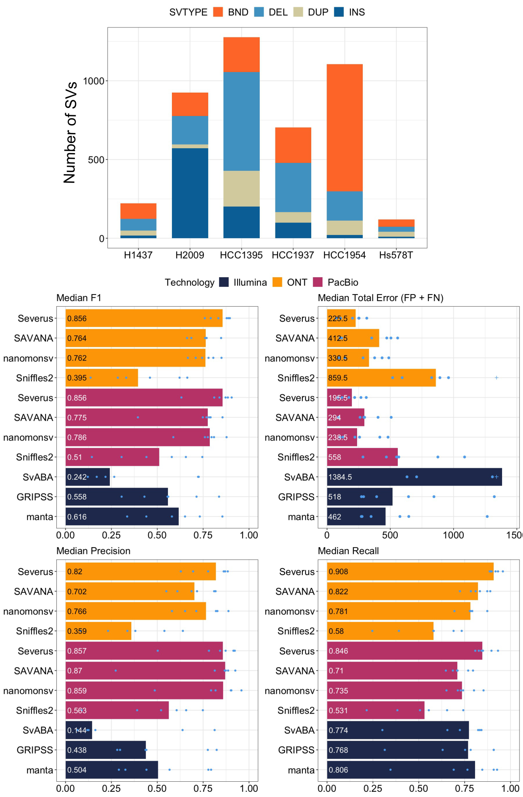

# CASTLE Panel -- CAncer Standards Long-read Evaluation
Currently, there is a limited availability of datasets containing long-read tumor sequencing data. To address this gap, we sequenced six cancer cell lines and their corresponding normal lines with next-generation sequencing ([Illumina](https://www.ncbi.nlm.nih.gov/sra/?term=SRR283051*+OR+SRR315374*+AND+Illumina+AND+Cell+AND+Line)) and long-read sequencing (both [PacBio](https://www.ncbi.nlm.nih.gov/sra/?term=SRR283051*+OR+SRR315374*+HiFi) and [ONT](https://www.ncbi.nlm.nih.gov/sra/?term=SRR283051*+OR+SRR315374*+ONT)) with high coverage (see [details](##sequencing-data)). 

We generated a set of confident somatic structural variation (SV) and single nucleotide variation(SNV) calls for each tumor cell line. These data, along with corresponding benchmarks, are being made publicly available to support and encourage the development of future methods.
## Sequencing Data
Native DNA was extracted from each cell line, and the same DNA extract was used for sequencing with all three platforms. For more details on library preparation, [please see](https://www.biorxiv.org/content/10.1101/2024.08.16.608331v1.full).  Raw sequencing data is available through NCBI SRA BioProject [PRJNA1086849](https://www.ncbi.nlm.nih.gov/bioproject/PRJNA1086849) and [Google Cloud](https://console.cloud.google.com/storage/browser/brain-genomics-public/publications/park2024_deepsomatic;tab=objects?prefix=&forceOnObjectsSortingFiltering=false). 

|Sample|Tissue/Cancer|Technology|Read length (Gb)|Coverage depth*|Reads N50 (kb)|SRA accession|
|------|-------------|----------|----------------|---------------|--------------|-------------|
|COLO829|Melanoma|ONT R9|361|112|40|[SRR28305188](https://www.ncbi.nlm.nih.gov/sra/?term=SRR28305188)|
|COLO829||Illumina|162|50|-|[SRR28305187](https://www.ncbi.nlm.nih.gov/sra/?term=SRR28305187)|
|COLO829BL|Blood|ONT R9|419|130|38|[SRR28305176](https://www.ncbi.nlm.nih.gov/sra/?term=SRR28305176)|
|COLO829BL||Illumina|395|123|-|[SRR28305165](https://www.ncbi.nlm.nih.gov/sra/?term=SRR28305165)|
|---------|
|HCC1954|Breast Ductal Carcinoma|ONT R10|253|79|28|[SRR28305164](https://www.ncbi.nlm.nih.gov/sra/?term=SRR28305164)|
|HCC1954||HiFi|195|60|17|[SRR28305163](https://www.ncbi.nlm.nih.gov/sra/?term=SRR28305163)|
|HCC1954||Illumina|232|72|-|[SRR28305162](https://www.ncbi.nlm.nih.gov/sra/?term=SRR28305162)|
|HCC1954BL|Blood|ONT R10|104|32|28|[SRR28305161](https://www.ncbi.nlm.nih.gov/sra/?term=SRR28305161)|
|HCC1954BL||HiFi|193|60|17|[SRR28305160](https://www.ncbi.nlm.nih.gov/sra/?term=SRR28305160)|
|HCC1954BL||Illumina|436|136|-|[SRR28305159](https://www.ncbi.nlm.nih.gov/sra/?term=SRR28305159)|
|---------|
|HCC1937|Breast Invasive Ductal Carcinoma|ONT R10|355|110|37|[SRR28305186](https://www.ncbi.nlm.nih.gov/sra/?term=SRR28305186)|
|HCC1937|Breast Invasive Ductal Carcinoma|ONT UL E821|572|178|48|[SRR31537484](https://www.ncbi.nlm.nih.gov/sra/?term=SRR28305184)|
|HCC1937||HiFi|184|57|15|[SRR28305185](https://www.ncbi.nlm.nih.gov/sra/?term=SRR28305185)|
|HCC1937||Illumina|740|231|-|[SRR28305184](https://www.ncbi.nlm.nih.gov/sra/?term=SRR28305184)|
|HCC1937BL|Blood|ONT R10|79|24|41|[SRR28305183](https://www.ncbi.nlm.nih.gov/sra/?term=SRR28305183)|
|HCC1937BL|Blood|ONT UL E821|172|53|45|[SRR31537483](https://www.ncbi.nlm.nih.gov/sra/?term=SRR31537483)|
|HCC1937BL||HiFi|172|53|16|[SRR28305182](https://www.ncbi.nlm.nih.gov/sra/?term=SRR28305182)|
|HCC1937BL||Illumina|218|68|-|[SRR28305181](https://www.ncbi.nlm.nih.gov/sra/?term=SRR28305181)|
|---------|
|H1437|Lung (NSCLC)|ONT R10|242|75|38|[SRR28305180](https://www.ncbi.nlm.nih.gov/sra/?term=SRR28305180)|
|H1437|Lung (NSCLC)|ONT UL E821|550|171|48|[SRR31537476](https://www.ncbi.nlm.nih.gov/sra/?term=SRR31537476)|
|H1437||HiFi|198|61|17|[SRR28305179](https://www.ncbi.nlm.nih.gov/sra/?term=SRR28305179)|
|H1437||Illumina|595|185|-|[SRR28305178](https://www.ncbi.nlm.nih.gov/sra/?term=SRR28305178)|
|BL1437|Blood|ONT R10|151|47|42|[SRR28305177](https://www.ncbi.nlm.nih.gov/sra/?term=SRR28305177)|
|BL1437|Blood|ONT UL E821|203|63|39|[SRR31537475](https://www.ncbi.nlm.nih.gov/sra/?term=SRR31537475)|
|BL1437||HiFi|218|68|18|[SRR28305175](https://www.ncbi.nlm.nih.gov/sra/?term=SRR28305175)|
|BL1437||Illumina|203|63|-|[SRR28305174](https://www.ncbi.nlm.nih.gov/sra/?term=SRR28305174)|
|---------|
|H2009|Lung (NSCLC)|ONT R10|329|102|27|[SRR28305173](https://www.ncbi.nlm.nih.gov/sra/?term=SRR28305173)|
|H2009|Lung (NSCLC)|ONT UL E821|516|161|65|[SRR31537473](https://www.ncbi.nlm.nih.gov/sra/?term=SRR31537473)|
|H2009||HiFi|201|62|16|[SRR28305172](https://www.ncbi.nlm.nih.gov/sra/?term=SRR28305172)|
|H2009||Illumina|669|209|-|[SRR28305171](https://www.ncbi.nlm.nih.gov/sra/?term=SRR28305171)|
|BL2009|Blood|ONT R10|92|28|37|[SRR28305170](https://www.ncbi.nlm.nih.gov/sra/?term=SRR28305170)|
|BL2009||HiFi|209|65|16|[SRR28305169](https://www.ncbi.nlm.nih.gov/sra/?term=SRR28305169)|
|BL2009||Illumina|171|53|-|[SRR28305168](https://www.ncbi.nlm.nih.gov/sra/?term=SRR28305168)|
|---------|
|Hs578T|Lung (NSCLC)|ONT R10|261|81|36|[SRR31537470](https://www.ncbi.nlm.nih.gov/sra/?term=SRR31537470)|
|Hs578T||HiFi|172|53|18|[SRR31537482](https://www.ncbi.nlm.nih.gov/sra/?term=SRR31537482)|
|Hs578T||Illumina|616|192|-|[SRR31537481](https://www.ncbi.nlm.nih.gov/sra/?term=SRR31537481)|
|Hs578Bst|Blood|ONT R10|113|35|40|[SRR31537480](https://www.ncbi.nlm.nih.gov/sra/?term=SRR31537480)|
|Hs578Bst||HiFi|84|26|12|[SRR31537479](https://www.ncbi.nlm.nih.gov/sra/?term=SRR31537479)|
|Hs578Bst||Illumina|102|31|-|[SRR31537478](https://www.ncbi.nlm.nih.gov/sra/?term=SRR31537478)|
|---------|
|HCC1395|Breast Invasive Ductal Carcinoma|ONT R10|246|76|10|[SRR28305167](https://www.ncbi.nlm.nih.gov/sra/?term=SRR28305167)|
|HCC1395BL|Blood|ONT R10|90|28|11|[SRR28305166](https://www.ncbi.nlm.nih.gov/sra/?term=SRR28305166)|
## Somatic Variation Analysis
### Structural Variation Calls
Since no ground truth SV calls are available, we created an ensemble of confident calls generated by merging the results from different methods and sequencing technologies using [Minda]( https://github.com/KolmogorovLab/minda). We used [Severus]( ( https://github.com/KolmogorovLab/Severus)), [nanomonsv]( https://github.com/friend1ws/nanomonsv), [SAVANA]( https://github.com/cortes-ciriano-lab/savana), [Sniffles2]( https://github.com/fritzsedlazeck/Sniffles), [SvABA]( https://github.com/walaj/svaba), [GRIDSS]( https://github.com/PapenfussLab/gridss), and [Manta]( https://github.com/Illumina/manta) to generate ensembles. Confident calls were defined if supported by at least two (out of three) technologies and at least 4 (out of 11) callers. This assumes that singleton calls are false-positives and that calls supported by multiple tools are more reliable. Severus consistently had the highest recall and precision against the ensemble SV sets. For more details on the method and statistics, please see [Severus preprint]( https://www.medrxiv.org/content/10.1101/2024.03.22.24304756v1). 

  

Individual vcfs and scripts for each caller are available at [here](https://doi.org/10.5281/zenodo.10856827).
For data preprocessing steps, please [see](https://github.com/KolmogorovLab/Severus/blob/main/README.md#preparing-phased-and-haplotagged-alignments)

This dataset is used to develop and evaluate the somatic structural variation (SV) caller [Severus]( https://github.com/KolmogorovLab/Severus).
### Single Nucleotide Variation Calls
## Cite
If you use the sequencing data, please cite [Severus]( https://www.medrxiv.org/content/10.1101/2024.03.22.24304756v1) and [DeepSomatic]( https://www.biorxiv.org/content/10.1101/2024.08.16.608331v1.full) preprints. 
## Contact
Please raise issues concerning this dataset in the Github repository.
